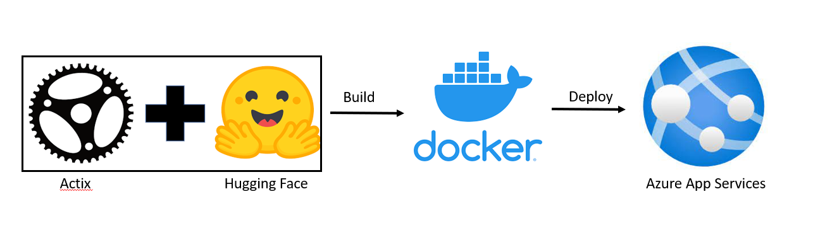
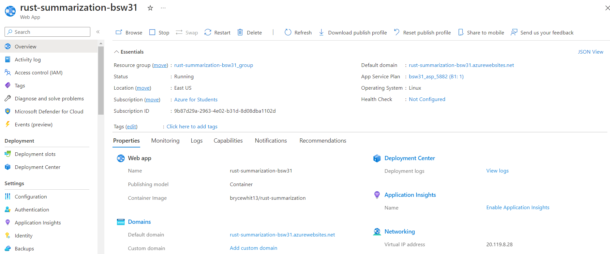

# Rust Summarization

## Description

The goal of this project is to create a microservice where someone can input a block of text, and the output will be a summarized version of the text. This is accomplished using the [distilbart-cnn-6-6 model](https://huggingface.co/sshleifer/distilbart-cnn-6-6) from [Hugging Face](https://huggingface.co/). The result will be an abstractive summary, which means the resulting sentences may not exist in the original text. The information will all come from the text, but it may be rearranged to make the summary more understandable and concise.

## Architecture

The application was developed in [Rust](https://www.rust-lang.org/) using the [Actix Web Framework](https://actix.rs/). It was then deployed to [Azure App Services](https://azure.microsoft.com/en-us/products/app-service/) from a [Docker Container](https://www.docker.com/resources/what-container/#:~:text=A%20Docker%20container%20image%20is,tools%2C%20system%20libraries%20and%20settings.).

## Running the Program

### Locally

1. Run `cargo run --release`
2. Navigate to [http://127.0.0.1:8080/](http://127.0.0.1:8080/)

### Docker

The docker container can be found publically available [here](https://hub.docker.com/r/brycewhit13/rust-summarization).

1. To pull the docker container, run `docker pull brycewhit13/rust-summarization`
2. TO run the docker container, run `docker run -d -p 8080:8080 brycewhit13/rust-summarization:latest`

### Github Release

The binary can be downloaded from the [releases page](https://github.com/brycewhit13/rust-summarization/releases). Selecting the most recent release will usually be the safest option.

### Online

The microservice can be accessed [here](https://rust-summarization-bsw31.azurewebsites.net/). It was deployed on Azure App Services with the following details:

If there are problems with the application, there is a decent chance I have stopped the instance to save myself from losing lots of money on accident. Let me know if this is the case and I'll be happy to get it back up and running. 

## Testing

If you would like to run unit tests on the functions, simply run the command `make test`. This will run the command `cargo test --quiet`. The tests can be found at the bottom on `src/lib.rs` if you are interested in taking a closer look at them. 
